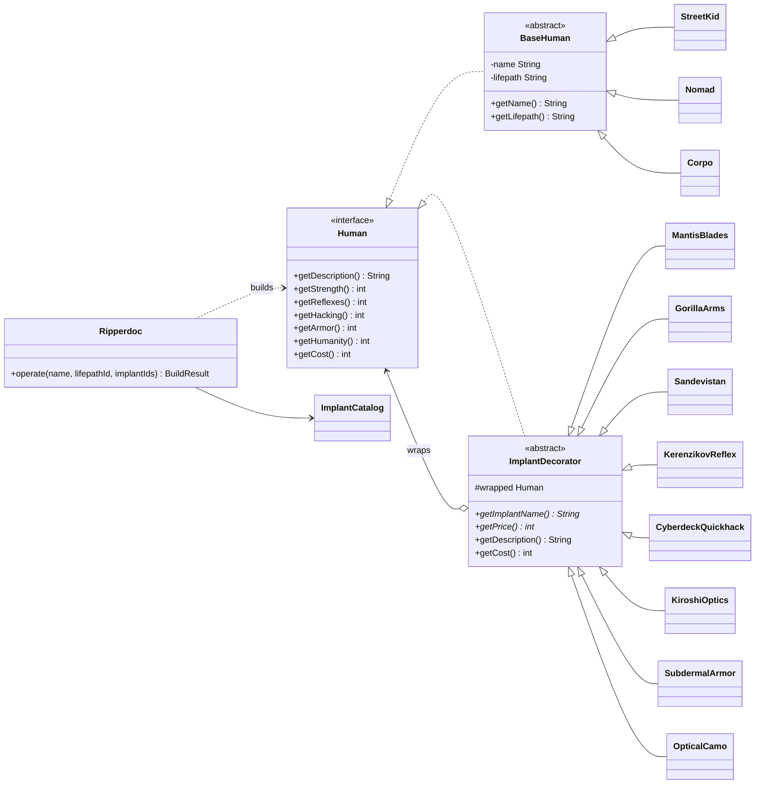
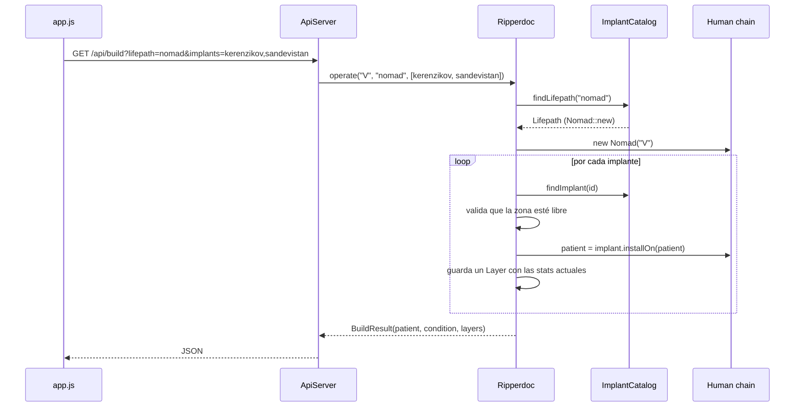

# Ripperdoc: Taller Patrón Decorator (Grupo 12)

Clínica de implantes cibernéticos inspirada en Cyberpunk. Un paciente humano llega con un *lifepath* (Street Kid, Nomad o Corpo) y el ripperdoc le instala implantes uno sobre otro. **Cada implante es un decorador** que envuelve al humano anterior y cambia sus estadísticas sin tocar su clase.

El proyecto tiene dos partes:

- **Back en Java 17 puro**, sin frameworks ni dependencias: el modelo, los decoradores y un servidor HTTP pequeño que trae el propio JDK.
- **Interfaz web** en HTML, CSS y JavaScript sin librerías, servida por ese mismo servidor. En ella se ve el patrón funcionando: cada decorador dibuja un anillo alrededor del cuerpo, la cadena se puede reordenar y el código Java equivalente se genera en vivo.

---

## Tabla de contenido

1. [Cómo correrlo](#cómo-correrlo)
2. [El patrón Decorator en este proyecto](#el-patrón-decorator-en-este-proyecto)
3. [Diagrama de clases](#diagrama-de-clases)
4. [Por qué el orden importa](#por-qué-el-orden-importa)
5. [Catálogo de lifepaths e implantes](#catálogo-de-lifepaths-e-implantes)
6. [Estructura de carpetas](#estructura-de-carpetas)
7. [Cómo viaja una petición](#cómo-viaja-una-petición)
8. [API](#api)
9. [La interfaz](#la-interfaz)
10. [Cómo agregar un implante nuevo](#cómo-agregar-un-implante-nuevo)
11. [Reglas del código](#reglas-del-código)
12. [Equipo y flujo de trabajo en GitHub](#equipo-y-flujo-de-trabajo-en-github)
13. [Problemas comunes](#problemas-comunes)

---

## Cómo correrlo

Requisito: **JDK 17 o superior**. Para verificarlo, `java -version` y `javac -version`.

macOS / Linux:

```bash
./run.sh
```

Windows:

```bat
run.bat
```

Luego abre **http://localhost:8080**.

El script borra `out/`, compila todo `src/` y arranca `com.group12.ripperdoc.Main`. Si el puerto 8080 está ocupado, pásale otro puerto:

```bash
./run.sh 8081
```

Si prefieres hacerlo a mano:

```bash
javac --release 17 -d out $(find src -name "*.java")
java -cp out com.group12.ripperdoc.Main
```

> El servidor lee los archivos de `web/` relativos a la carpeta desde donde se ejecuta. Arráncalo siempre desde la raíz del proyecto, que es lo que hacen los scripts.

**Desde IntelliJ:** marca `src` como *Sources Root*, configura el *Working directory* del Run Configuration en la raíz del proyecto y ejecuta `Main`.

---

## El patrón Decorator en este proyecto

El Decorator agrega responsabilidades a un objeto **en tiempo de ejecución** envolviéndolo en otro objeto que cumple la misma interfaz. No hace falta crear subclases para cada combinación. Aquí no existe una clase `NomadWithMantisBladesAndSandevistan`: se arma así:

```java
Human patient =
    new Sandevistan(
        new MantisBlades(
            new Nomad("V")));

patient.getReflexes();
patient.getDescription();
```

Correspondencia de roles:

| Rol del patrón           | Clase en el proyecto                                                   | Responsabilidad |
|--------------------------|------------------------------------------------------------------------|-----------------|
| **Component**            | `model/Human` (interface)                                              | Contrato común: `getDescription`, `getStrength`, `getReflexes`, `getHacking`, `getArmor`, `getHumanity`, `getCost`. |
| **Concrete Component**   | `model/BaseHuman` (abstracta) y sus hijas `StreetKid`, `Nomad`, `Corpo` | El humano sin modificar. Cada lifepath tiene stats base distintas. |
| **Decorator**            | `decorator/ImplantDecorator` (abstracta)                               | Implementa `Human`, guarda `protected final Human wrapped` y **delega todo** en él. Además ya resuelve `getDescription` (agrega el nombre del implante) y `getCost` (suma el precio). |
| **Concrete Decorators**  | `MantisBlades`, `GorillaArms`, `Sandevistan`, `KerenzikovReflex`, `CyberdeckQuickhack`, `KiroshiOptics`, `SubdermalArmor`, `OpticalCamo` | Cada uno sobrescribe **solo** los métodos que cambia y siempre parte del valor de `wrapped`. |
| **Client**               | `service/Ripperdoc`                                                    | Arma la cadena en el orden pedido y valida las reglas de la clínica. |

Así se ve un decorador concreto completo:

```java
public class MantisBlades extends ImplantDecorator {

    public static final String NAME = "Mantis Blades";
    public static final int PRICE = 9000;

    public MantisBlades(Human wrapped) {
        super(wrapped);
    }

    @Override
    public String getImplantName() {
        return NAME;
    }

    @Override
    public int getPrice() {
        return PRICE;
    }

    @Override
    public int getStrength() {
        return wrapped.getStrength() + 20;
    }

    @Override
    public int getReflexes() {
        return wrapped.getReflexes() + 10;
    }

    @Override
    public int getHumanity() {
        return wrapped.getHumanity() - 18;
    }
}
```

Hay dos ideas clave:

1. **Nadie conoce la clase real de lo que envuelve.** `MantisBlades` recibe un `Human`, que puede ser un `Nomad` sin modificar u otro decorador. Por eso los implantes se pueden apilar en cualquier combinación.
2. **La llamada viaja hacia adentro y el resultado vuelve hacia afuera.** Cuando se pide `getReflexes()` al decorador externo, este se lo pide al de adentro, y así hasta llegar al `Nomad`. Cada capa aplica su cambio cuando el valor regresa.

### Estado del paciente

`model/Condition` traduce la humanidad final a un estado:

| Humanidad | Estado           |
|-----------|------------------|
| 50 o más  | `STABLE`         |
| 20 a 49   | `UNSTABLE`       |
| menos de 20 | `CYBERPSYCHOSIS` |

Los umbrales son constantes en `Condition` (`STABLE_THRESHOLD`, `PSYCHOSIS_THRESHOLD`) y la interfaz los lee desde la API, así que basta con cambiarlos en un solo lugar.

---

## Diagrama de clases



La flecha `ImplantDecorator o--> Human` es el corazón del patrón: el decorador **es** un `Human` y además **tiene** un `Human`.

---

## Por qué el orden importa

La mayoría de implantes **suman** o **restan**, pero dos **multiplican** lo que envuelven:

- `Sandevistan`: reflejos x1.5
- `CyberdeckQuickhack`: hacking x1.4

Ejemplo con un Nomad (reflejos base 40):

| Cadena (de adentro hacia afuera)        | Cálculo             | Reflejos |
|-----------------------------------------|---------------------|----------|
| Nomad, luego Kerenzikov, luego Sandevistan | (40 + 15) x 1.5  | **83**   |
| Nomad, luego Sandevistan, luego Kerenzikov | (40 x 1.5) + 15  | **75**   |

Mismos implantes, mismo precio, mismo costo de humanidad, y aun así resultados distintos. En la interfaz se puede comprobar arrastrando las filas de la *Decorator chain*.

---

## Catálogo de lifepaths e implantes

### Lifepaths (Concrete Components)

| Clase       | Fuerza | Reflejos | Hacking | Armadura | Humanidad |
|-------------|-------:|---------:|--------:|---------:|----------:|
| `StreetKid` | 40     | 45       | 30      | 20       | 95        |
| `Nomad`     | 50     | 40       | 20      | 30       | 100       |
| `Corpo`     | 25     | 30       | 55      | 15       | 90        |

### Implantes (Concrete Decorators)

Solo cabe **un implante por zona del cuerpo** (`BodySlot`). Si se pide otro en la misma zona, `Ripperdoc` responde con error.

| Clase                | Zona                 | Precio (€$) | Efecto                    |
|----------------------|----------------------|------------:|---------------------------|
| `Sandevistan`        | Operating System     | 14,000      | x1.5 REF, -25 HUM         |
| `CyberdeckQuickhack` | Operating System     | 12,000      | x1.4 HACK, -15 HUM        |
| `KiroshiOptics`      | Face                 | 3,000       | +5 REF, +10 HACK, -6 HUM  |
| `KerenzikovReflex`   | Nervous System       | 5,000       | +15 REF, -10 HUM          |
| `MantisBlades`       | Arms                 | 9,000       | +20 STR, +10 REF, -18 HUM |
| `GorillaArms`        | Arms                 | 7,500       | +35 STR, +5 ARM, -14 HUM  |
| `SubdermalArmor`     | Skeleton             | 6,000       | +30 ARM, -5 REF, -12 HUM  |
| `OpticalCamo`        | Integumentary System | 8,500       | +10 ARM, +5 HACK, -12 HUM |

Con 6 implantes (uno por zona) un Corpo baja a 7 de humanidad y entra en `CYBERPSYCHOSIS`.

---

## Estructura de carpetas

```
.
├── src/com/group12/ripperdoc/
│   ├── Main.java                  Punto de entrada: arranca el servidor
│   ├── model/                     Component y Concrete Components
│   │   ├── Human.java
│   │   ├── BaseHuman.java
│   │   ├── StreetKid.java
│   │   ├── Nomad.java
│   │   ├── Corpo.java
│   │   └── Condition.java
│   ├── decorator/                 Decorator abstracto y decoradores concretos
│   │   ├── ImplantDecorator.java
│   │   └── (8 implantes).java
│   ├── service/                   Reglas de la clínica (no conoce HTTP)
│   │   ├── BodySlot.java          Zonas del cuerpo
│   │   ├── Implant.java           Ficha de catálogo + cómo instalarlo
│   │   ├── Lifepath.java          Ficha de catálogo + cómo crear el humano base
│   │   ├── ImplantCatalog.java    Registro de lifepaths e implantes
│   │   ├── Ripperdoc.java         Arma la cadena y valida
│   │   ├── Layer.java             Foto de las stats después de cada capa
│   │   └── BuildResult.java       Resultado final
│   └── api/                       Capa HTTP (no tiene lógica de negocio)
│       ├── ApiServer.java
│       └── Json.java              Escritor JSON mínimo, sin dependencias
├── web/
│   ├── index.html
│   ├── styles.css
│   └── app.js
├── run.sh / run.bat
└── README.md
```

Las dependencias van en una sola dirección: `api` usa `service`, `service` usa `decorator` y `model`, y `decorator` usa `model`. `model` no conoce a nadie.

---

## Cómo viaja una petición



`ImplantCatalog` registra cada implante con una referencia al constructor (`MantisBlades::new`). Por eso `Ripperdoc` no necesita un `switch` ni conocer las clases concretas.

---

## API

Todas las respuestas son JSON y todas las rutas son `GET`.

### `GET /api/lifepaths`

```json
[{ "id": "nomad", "name": "Nomad", "className": "Nomad",
   "description": "...", "stats": { "strength": 50, "reflexes": 40, "hacking": 20,
   "armor": 30, "humanity": 100, "cost": 0 } }]
```

### `GET /api/implants`

```json
[{ "id": "sandevistan", "name": "Sandevistan", "className": "Sandevistan",
   "slot": "OPERATING_SYSTEM", "slotLabel": "Operating System", "price": 14000,
   "effect": "x1.5 REF, -25 HUM", "description": "..." }]
```

### `GET /api/build?name=V&lifepath=nomad&implants=kerenzikov,sandevistan`

| Parámetro  | Obligatorio | Descripción |
|------------|-------------|-------------|
| `lifepath` | sí          | `street-kid`, `nomad` o `corpo` |
| `implants` | no          | ids separados por coma, **en orden de adentro hacia afuera** |
| `name`     | no          | Nombre del paciente (por defecto `V`, máximo 24 caracteres) |

Respuesta `200`:

```json
{
  "description": "V the Nomad + Kerenzikov + Sandevistan",
  "stats": { "strength": 50, "reflexes": 83, "hacking": 20, "armor": 30, "humanity": 65, "cost": 19000 },
  "condition": "STABLE",
  "thresholds": { "stable": 50, "psychosis": 20 },
  "layers": [
    { "id": "nomad", "name": "Nomad", "className": "Nomad", "description": "V the Nomad", "stats": { } },
    { "id": "kerenzikov", "name": "Kerenzikov", "className": "KerenzikovReflex", "stats": { } },
    { "id": "sandevistan", "name": "Sandevistan", "className": "Sandevistan", "stats": { } }
  ]
}
```

`layers` trae una foto de las stats después de cada capa. La interfaz la usa para mostrar cuánto cambió cada decorador.

Respuesta `400`, por ejemplo con dos implantes en la misma zona:

```json
{ "error": "Arms slot is already taken by Mantis Blades" }
```

Prueba rápida desde la terminal:

```bash
curl "http://localhost:8080/api/build?lifepath=nomad&implants=kerenzikov,sandevistan"
```

---

## La interfaz

La dirección visual se tomó del menú de cyberware de un ripperdoc: una consola clínica monocroma color hueso con acentos rojos. Se evitó a propósito el típico neón sobre negro. Hay tema claro y oscuro (botón arriba a la derecha) y en móvil se reorganiza en una sola columna.

| Zona | Qué muestra | Relación con el patrón |
|------|-------------|------------------------|
| Patient | Nombre y lifepath | Elegir el **Concrete Component** |
| Implant catalog | Implantes agrupados por zona; *Install*, *Remove* o *Swap* | Cada tarjeta es un **Concrete Decorator** |
| Silueta con anillos | Un anillo por capa: el interior es el humano base y el exterior (rojo) el último decorador | El **envoltorio** hecho visible |
| Decorator chain | Lista ordenada con lo que cambió cada capa; se reordena arrastrando o con flechas | El **orden de composición** |
| Humanity | Medidor con los umbrales y un ECG que se acelera según el estado | `Condition` |
| Body stats / Bill | Barras animadas con delta y costo total | Resultado de la cadena completa |
| The same build in Java | El `new X(new Y(...))` equivalente y la salida de `getDescription()` | El código que el back ejecuta de verdad |

La construcción actual se guarda en el `localStorage` del navegador, así que al recargar se recupera.

Todo el cálculo lo hace Java. `app.js` solo pide `/api/build` y dibuja la respuesta. Las únicas reglas que el front repite son de presentación: reemplazar un implante si la zona está ocupada y la posición de los marcadores en la silueta.

---

## Cómo agregar un implante nuevo

Ejemplo: un implante `ReinforcedTendons` para las piernas que suma 10 de reflejos y 5 de fuerza.

**1. Crear el decorador** en `src/com/group12/ripperdoc/decorator/ReinforcedTendons.java`:

```java
package com.group12.ripperdoc.decorator;

import com.group12.ripperdoc.model.Human;

public class ReinforcedTendons extends ImplantDecorator {

    public static final String NAME = "Reinforced Tendons";
    public static final int PRICE = 4000;

    public ReinforcedTendons(Human wrapped) {
        super(wrapped);
    }

    @Override
    public String getImplantName() {
        return NAME;
    }

    @Override
    public int getPrice() {
        return PRICE;
    }

    @Override
    public int getStrength() {
        return wrapped.getStrength() + 5;
    }

    @Override
    public int getReflexes() {
        return wrapped.getReflexes() + 10;
    }

    @Override
    public int getHumanity() {
        return wrapped.getHumanity() - 8;
    }
}
```

**2. Si la zona no existe**, agregarla en `service/BodySlot.java`:

```java
LEGS("Legs");
```

**3. Registrarlo** en el constructor de `service/ImplantCatalog.java`:

```java
addImplant(new Implant("reinforced-tendons", ReinforcedTendons.NAME, ReinforcedTendons.class.getSimpleName(),
        BodySlot.LEGS, ReinforcedTendons.PRICE, "+5 STR, +10 REF, -8 HUM",
        "Carbon fiber tendons for longer jumps.", ReinforcedTendons::new));
```

**4. Solo si creaste una zona nueva**, darle una posición en la silueta dentro de `web/app.js`:

```js
const SLOT_MARKERS = {
  ...
  LEGS: [[256, 420], [304, 420]],
};
```

Con eso basta. El catálogo, la cadena, los anillos y el código Java generado lo toman solos. No hay que tocar `Ripperdoc`, `ApiServer` ni el HTML.

**Para agregar un lifepath** se sigue la misma idea: una clase que extienda `BaseHuman` en `model/` y una línea `addLifepath(...)` en `ImplantCatalog`.

---

## Reglas del código

- El código va en **inglés**: clases, métodos, variables y textos de la interfaz.
- **Sin comentarios** ni emojis, en Java, JS, CSS y HTML. Los nombres tienen que explicarse solos.
- Java 17 sin dependencias externas. No agregar Maven, Gradle ni librerías.
- Un decorador concreto solo sobrescribe lo que cambia y siempre parte de `wrapped`.
- La lógica de negocio va en `service`, nunca en `api` ni en `app.js`.

---

## Equipo y flujo de trabajo en GitHub

Repositorio: https://github.com/Juansit-0/TallerPatronDecoratorGrupo12

| Persona | Rama | Responsabilidad | Archivos |
|---------|------|-----------------|----------|
| P1 (dueño del repo) | `main` | Base del proyecto y Component | `.gitignore`, `README.md` (versión inicial), `run.sh`, `run.bat`, `src/.../model/*` |
| P2 | `feature/decorator-base` | Decorator abstracto y primeros implantes | `decorator/ImplantDecorator.java`, `MantisBlades`, `GorillaArms`, `Sandevistan`, `KerenzikovReflex` |
| P3 — [Guerrero Alexander](https://github.com/GUERRREROALEXANDER) | `feature/implants-service` | Resto de implantes y lógica de la clínica | `CyberdeckQuickhack`, `KiroshiOptics`, `SubdermalArmor`, `OpticalCamo`, `src/.../service/*` |
| P4 | `feature/api-web` | Servidor, interfaz y documentación final | `Main.java`, `src/.../api/*`, `web/*`, `README.md` final |

Los PR se mergean **en orden** (P2, luego P3, luego P4), porque cada capa depende de la anterior.

Flujo para cada persona:

```bash
git clone https://github.com/Juansit-0/TallerPatronDecoratorGrupo12.git
cd TallerPatronDecoratorGrupo12
git checkout main
git pull
git checkout -b feature/<tu-rama>
```

```bash
git add <solo tus archivos>
git commit -m "feat: <qué agregaste>"
git push -u origin feature/<tu-rama>
```

Después se abre el Pull Request hacia `main` en GitHub, otro integrante lo revisa y se mergea. Antes de empezar la siguiente parte, `git checkout main && git pull`.

Convención de commits: `feat:` para algo nuevo, `fix:` para correcciones, `docs:` para el README y `style:` para cambios visuales.

---

## Problemas comunes

| Síntoma | Causa | Solución |
|---------|-------|----------|
| `Port 8080 is busy` | Otro programa usa el puerto | `./run.sh 8081` |
| La página muestra "The clinic server is not answering" | El servidor no está corriendo o se abrió `index.html` con doble clic | Correr `./run.sh` y entrar por `http://localhost:8080` |
| 404 en `/` | El servidor se arrancó desde otra carpeta | Ejecutarlo desde la raíz del proyecto |
| `javac: invalid flag --release` | JDK menor a 9 | Instalar JDK 17 o superior |
| `permission denied: ./run.sh` | El script no tiene permiso de ejecución | `chmod +x run.sh` |
| Los cambios en `web/` no se ven | Caché del navegador | El servidor ya envía `no-store`; recarga con Ctrl+Shift+R |
